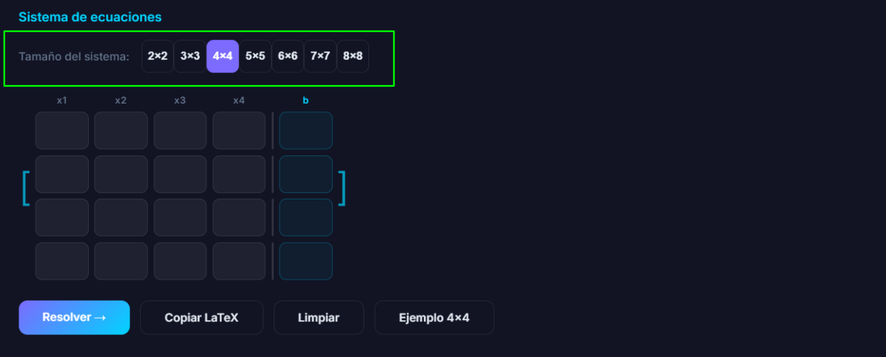
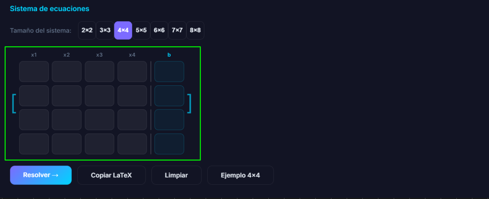
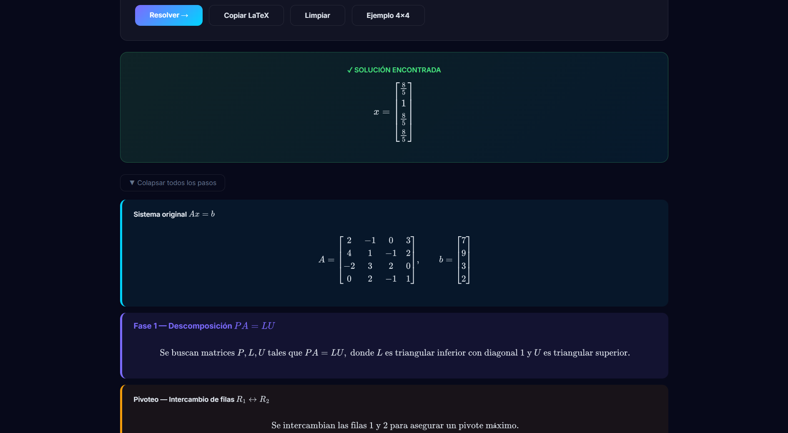

# Manual de Usuario - Resolución de SEL por Descomposición LU

Este manual describe el paso a paso para utilizar el programa y explica de forma detallada su funcionamiento interno.

---

## Guía de Uso (Paso a Paso)

### 1. Preparación y Ejecución

1. Abre tu terminal o consola de comandos.
2. Instala las dependencias necesarias mediante el archivo `requirements.txt`:
   ```bash
   pip install -r requirements.txt
   ```
3. Ejecuta el archivo principal:
   ```bash
   python app.py
   ```

### 2. Interfaz Principal y Selección del Sistema

Al abrir el programa, verás la ventana principal que presenta en la zona media un panel de configuración.

- **Seleccionar Tamaño:** En la fila "Tamaño del sistema", selecciona la dimensión para la matriz cuadrada (desde 2x2 hasta 8x8).



### 3. Ingreso de Datos

- Tienes una matriz correspondiente a las variables $x_1, x_2, \dots$ y una columna de resultados finales para el vector $b$.
- Puedes ingresar los valores manualmente y navegar entre las celdas rápidamente usando la tecla `Enter`.
- Si deseas probar el funcionamiento del programa rápidamente, haz clic en el botón **Ejemplo 4x4** para cargar valores matriciales de testeo.



### 4. Resolución del Sistema

- Presiona el botón azul **Resolver →**.
- El programa realizará el cálculo internamente. Si todo es correcto, saltará un cartel verde de "SOLUCIÓN ENCONTRADA", arrojándote el vector resultante $x$.
- En la parte inferior, verás el reporte paso a paso con las matrices calculadas $P$, $L$ y $U$, junto el sistema de sustituciones en notación matemática exacta.



### 5. Exportar a LaTeX

- Puedes exportar todo el sistema (con notación de las matrices y las ecuaciones) en código LaTeX puro usando el botón **Copiar LaTeX**.
- De inmediato aparecerá una notificación abajo diciendo "¡Copiado!". Tendrás los códigos almacenados en el portapapeles, listos para ser pegados en entornos como Word/Overleaf.

---

## Funcionamiento Interno del Programa

La aplicación está dividida en dos grandes componentes arquitectónicos: la interfaz gráfica o Frontend web incrustado (`app.py`), y el núcleo matemático de procesamiento o Backend (`lu_solver.py`).

### 1. El Puente entre la Interfaz Gráfica (Frontend) y Python (`app.py`)

Aunque el programa se distribuye en Python de escritorio, la interfaz moderna emplea **HTML, CSS y JavaScript** puro. Se ha implementado **PyQt6**, específicamente su visor embebido de alta velocidad de Chromium (`QWebEngineView`), para inyectar este HTML local.

#### Comunicación Bidireccional (`QWebChannel`)

Para que los inputs/botones de HTML y JavaScript envíen sus acciones y cálculos hacia Python, existe un "puente" invisible de comunicación instanciado sobre un WebChannel en red local:

- El software crea una clase nativa de Python (`Bridge`) con funciones "expuestas" al navegador gracias al atributo decorador especial `@pyqtSlot`.
- Cuando el usuario solicita "Resolver", JavaScript lee los cuadrantes HTML de la matriz, estructura estos datos a una sintaxis serializada compacta en formato genérico (`JSON`) y los inyecta al puente.
- Python los recibe a través del método de recepción `solve`, decodifica el objeto a una lista de Python para delegarlo directamente a la función de resolución matemática y devuelve los datos por el mismo canal, en donde luego se insertan al árbol HTML mediante la librería **MathJax** para crear símbolos visuales agradables a la vista.

### 2. El Núcleo del Solver Computacional (`lu_solver.py`)

Este módulo es el ente del hardware matemático puro de la aplicación, ejecutando algoritmos algebraicos sin bloqueos. Emplea el método directo de la matriz **LU - Algoritmo de Doolittle**, enriquecido con pivoteo parcial. Para esto recurre a la popular biblioteca de alto rendimiento `NumPy`.

Opera bajo tres fases centrales:

#### Fase 1: Descomposición $PA = LU$

En el algoritmo original de un sistema $Ax=b$, se busca fragmentar la matriz de coeficientes $A$ en el producto de dos matrices especiales: $L$ (una matriz triangular _inferior_ con su diagonal dominada por 1s) y $U$ (una matriz triangular _superior_).

- **Pivoteo Parcial:** Las computadoras pierden gran fidelidad o sufren errores críticos (_ZeroDivisionError_) al toparse con divisores minúsculos o ceros matriciales. Previo al cálculo, la lógica busca el valor absoluto más alto de la columna de turno, y si requiere permutar su posición de fila, lo hace. Todo movimiento o intercambio es encriptado en el registro de control de identidad: La matriz permutada $P$.
- **Generación y Eliminación:** Ejecuta las reglas de Doolittle operando iterativamente y reduciendo filas por coeficientes en los triángulos inversos. Si $U$ es nula en su diagonal para esa etapa y no se puede pivotar más, detecta el determinante muerto identificando matrices matemáticamente "_singulares_" y retornando un vector de error limpio que neutraliza un quiebre de hardware en la computadora.

#### Fase 2: Sustitución de Avance ($Lz = Pb$)

Con la meta dividida, ataca su primer sistema simple tomando la fila originaria alterada y calculando el vector intermedio ($z$). Como $L$ es siempre triangular en descenso sin ceros (con todos los unos en la diagonal), realiza sus ecuaciones directamente con una escalera preformada y despejable en fracciones de tiempo sin un sistema completo iterativo.

#### Fase 3: Sustitución de Retroceso ($Ux = z$)

Para encontrar el valor real del sistema ($x$) conociendo la sustitución final, Python invierte el sentido de lectura y efectúa la evaluación _bottom up_ (desde el último índice hasta la coordenada de origen), apoyado sobre la segunda fragmentación matriz $U$. El resultado es empaquetado y enviado de vuelta al `app.py`.

#### Tolerancia y Formateo Preciso ($\LaTeX$)

Dado que un decimal de punto flotante de la PC puede llegar como `0.3333333334`, el _solver_ previene interfaces engorrosas al leerlo e interceptando dicho dato internamente en la función de control de margen iterativo y aproximación decimal (`fmt`). Dicha función de control implementa el módulo subyacente `fractions` de Python, que identifica tolerancias residuales y autoprocesa el remanente llevándolo a formato de cadena puro ($\frac{a}{y}$), evitando perder información matemática y asegurando explicaciones académicas de altísima calidad.
